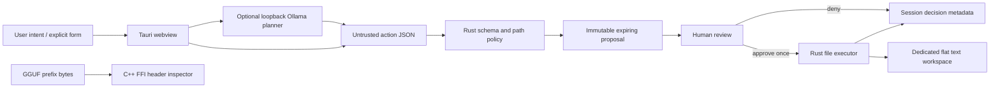

# LocalTrust Desktop

**A local assistant that proposes file operations and waits for your decision.**

Local models should not inherit unrestricted access to your computer. LocalTrust separates model planning from execution: a Rust broker validates a small action vocabulary, stores the exact proposal, and requires a single-use human decision before touching a dedicated workspace.

This is a working portfolio prototype, not a hardened OS sandbox. The default demo needs neither a GPU nor model weights, credentials, or paid services.

## Try it

```sh
# Node.js 22+; no dependency installation required for the browser demo
npm run demo
# open http://127.0.0.1:4173
```

1. Preview the synthetic meeting note. No file exists yet.
2. Deny it; the session records the decision.
3. Preview again and approve once.
4. Select **Read a text file**, keep the filename, and approve the read.
5. Try `../private.txt` or create the same filename again; the proposal is rejected.

The browser demo is explicitly synthetic: files exist only in memory and disappear on refresh. The native app performs real operations under its application-local-data `workspace` directory. These are separate adapters; browser checks do not prove native enforcement.

## Native quick start

Install stable Rust and a C++ compiler. For the desktop, also install the [Tauri platform prerequisites](https://v2.tauri.app/start/prerequisites/).

```sh
cargo test --all-targets
cargo run -- ./demo-workspace
# enter: {"action":"create","path":"note.txt","content":"Hello locally"}
# review the JSON, then type APPROVE

npm install
npm run desktop
```

The CLI provides the same broker without requiring a graphical environment. EOF exits it. No shell execution is implemented.

Optional local planning: run Ollama locally, install a model yourself (for example `ollama pull qwen2.5:3b`), then expand **Plan with local Ollama** in the native app. The request sends your typed prompt to `127.0.0.1:11434`; it sends no workspace file contents. An unavailable server/model or invalid action produces an error. Model setup initially needs network access; subsequent inference can run offline when the model is present. Verify your Ollama configuration and use a local model, not a cloud-backed model.

## Architecture



**Actual stack:** Rust, Tauri 2, C++ through the `cc` build crate and a narrow C ABI, vanilla HTML/CSS/JavaScript, optional Ollama HTTP API. No frontend framework or remote assets. The C++ utility checks GGUF magic/version/minimum header length; it does not load or quantize models. llama.cpp inference wrappers and OS event hooks are roadmap items, not implemented integrations.

## Enforced native behavior

| Control | Implementation |
|---|---|
| Small capability set | Only read and create; strict tagged JSON rejects unknown actions/fields |
| User decision | Broker stores immutable actions, decisions contain only an ID and boolean |
| Replay / expiry | Consumed once, expires after 120 seconds, at most 32 pending proposals |
| Workspace limits | Flat ASCII `.txt` filenames, reserved Windows names denied, no traversal or directories |
| Existing data | Atomic `create_new` prevents overwriting existing files |
| Bounded content | 32 KiB UTF-8 text; bounded reads and model responses |
| Local planning | Fixed loopback address, no redirects, 60-second timeout |
| Minimal activity | Last 100 decisions in memory; no file contents in activity records |

## Verification

```sh
npm test
cargo test --all-targets
cargo clippy --all-targets -- -D warnings
cargo build --manifest-path src-tauri/Cargo.toml
```

CI runs Rust/C++ tests and lint on Linux and Windows, browser adapter tests on both, and a Linux desktop build. See [Actions](https://github.com/dileepreddy27/localtrust-desktop/actions) for authoritative results. Tests cover approval/no early write, denial, replay, expiry, path traversal, reserved names, overwrite races, size limits, strict model schema, GGUF prefix validation, and Unix symlink denial. See [verification notes](docs/VERIFICATION.md) for observed evidence and remaining checks.

## Threat model and tradeoffs

The model is untrusted; action arguments always pass the broker. The human reviews the exact payload, not a model-written safety assessment. Tauri exposes no shell or filesystem plugin. Model output and file contents are rendered with `textContent`.

The application, webview, local OS account, and workspace directory are trusted. A compromised frontend could invoke approval itself. Another process under the same user can race path checks or modify files; read symlink/hardlink races are not fully mitigated. The directory must not be shared with an adversarial writer. Sequential Rust locking protects broker decisions, not external processes. IDs are session identifiers, not authentication secrets.

Reads approve a path, not a frozen content snapshot. Creates can leave a partial new file on an I/O failure. Audit records are volatile and not tamper-evident. Denied reads are not performed, but proposal validation inspects file metadata. There is no encryption, attestation, privilege separation, persistent rollback, signed packaging, telemetry, or production security certification.

## Roadmap

- Capability-safe directory handles and OS-specific race-resistant read primitives.
- Signed installers, platform UI tests, and external approval surface.
- Opt-in selected browser text capture and reversible edits with reviewed diffs.
- llama.cpp model loading and GGUF metadata inspection beyond the fixed prefix.
- Benchmark local inference on documented hardware before making performance claims.

## Resume-ready evidence

- Built a Rust/Tauri desktop prototype that separates local model planning from single-use, expiring user approvals for bounded filesystem actions.
- Implemented a C++ GGUF-prefix validator behind a Rust FFI boundary and cross-platform policy tests for replay, traversal, content limits, and overwrite protection.

## References and license

[Tauri configuration](https://v2.tauri.app/reference/config/) · [Ollama API](https://github.com/ollama/ollama/blob/main/docs/api.md) · [GGUF format](https://github.com/ggml-org/ggml/blob/master/docs/gguf.md)

MIT. All demo notes are synthetic and authored for this project. Model weights are not bundled; their licenses apply separately.
